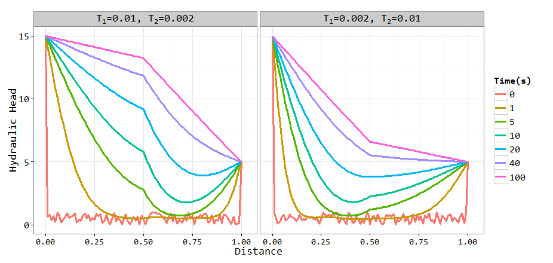

# One dim groundwater flow simulation,  kriging and idw interpolatiaon
kongdd  
Friday, January 16, 2015  

> kongdd  
> email: kongdd@mail2.sysu.edu.cn  
> Sun Yat-Sen University, Guangzhou, China  

### Problem 1

The ground flow equation for 1D heterogeneous, isotropic porous medium with a constant aquifer thickness is given by:  
Where h(x,t) is the hydraulic head, T(x) is the transmissivity, and S is the storativity. The boundary conditions imposed are constant head hL (15m) and hR (5m) at the left and right ends of soil column, respectively. The initial condition is 0 or random number at each node. The length of aquifer is 1m (L=1m). The storativity is 1 (S = 1).  
Develop a MATLAB program which can handle a heterogeneous transmissivity field using the implicit method.  

1.Test the program for the case of homogenous parameters, and compare the results with the results generated from flow equation with homogenous transmissivity field (i.e.,  )  
  均质情况下一维地下水运动
```matlab
function plot_Data = oneDimGroudwaterFlowHom(hL,hR,L,S,T,method,dx,dt)
%%  Finite difference method to solve 1-D flow equation
%%  Writed By Dongdong Kong, 2014-01-07
%   Sun Yat-Sen University, Guangzhou, China
%   emal: kongdd@mail2.sysu.edu.cn
%   ------------------------------------------------------
%   one dimension groundwater flow model script
%   which can handle a heterogeneous transmissivity field
%   ------------------------------------------------------
%   because of T value, this function only suit for patch-heterogeneous T 
%   field comprises a two-zone T field, or homogeneous field. you can Modify
%   input discreted T value to suit other heterogeneous situation.
%   ------------------------------------------------------
%     hL    % left constant hydraulic head (m)
%     hR    % left constant hydraulic head (m)
%     L     % the length of aquifer
%     S     % storativity
%     T     % transmissivity
%     method% 'forward' or 'backward' approximation
%   ------------------------------------------------------
x=0:dx:L;   nx=length(x);
w=T/S*dt/dx/dx;
h=rand(nx,1);
h(1)=hL; h(end)=hR; 
times = 100;
Result = zeros(nx,times+1);
 
if strcmp(method,'forward')
    %%  forward approximation
    W=(1-2*w)*diag(ones(nx,1),0)+...
        w*diag(ones(nx-1,1),1)+...
        w*diag(ones(nx-1,1),-1);
    W(1,1)=1;W(1,2)=0;
    W(nx,nx)=1;W(nx,nx-1)=0;
    
    for i=1:times+1
        Result(:,i)=h;
        h=W*h;
    end
elseif strcmp(method,'backward')
    %% backward approximation
    w=T/S*dt/dx/dx;
    W=(1+2*w)*diag(ones(nx,1),0) - ...
        w*diag(ones(nx-1,1),1) - ...
        w*diag(ones(nx-1,1),-1);
    W(1,1)=1;W(1,2)=0;
    W(nx,nx)=1;W(nx,nx-1)=0;
 
    for i=1:times+1
        Result(:,i)=h;
        h=W\h;
    end
else
    warning('error method input, method can be only set ''forward'',''backward''')
end
figure 
timeID=[0 1 5 10 20 40 100]+1;
plot_Data=Result(:,timeID);
plot(x,plot_Data,'linewidth',1.5)
legend({'t=   0','t=   1','t=   5','t=  10','t=  20','t=  40','t= 100'})
```  


2.Test the program for patch- heterogeneous T field, which comprises a two-zone T field with a fivefold difference in transmissivity (T1=5T2, T1=0.01m2s-1, T2=0.002m2s-1 ; or, T1=0.2T2, T1=0.002m2s-1, T2=0.01m2s-1) and an interface in the middle of the domain.
    非均质情况下一维地下水运动
```matlab
function plot_Data = oneDimGroudwaterFlowHet(hL, hR, L, S, T)
%% 	Finite difference method to solve 1-D flow equation
%%  Writed By Dongdong Kong, 2014-01-07
%   Sun Yat-Sen University, Guangzhou, China
%   emal: kongdd@mail2.sysu.edu.cn
%   ------------------------------------------------------
%   one dimension groundwater flow model script
%   which can handle a heterogeneous transmissivity field
%   ------------------------------------------------------
%   because of T value, this function only suit for patch-heterogeneous T 
%   field comprises a two-zone T field, or homogeneous field. you can Modify
%   input discreted T value to suit other heterogeneous situation.
%   ------------------------------------------------------
%     hL    % left constant hydraulic head (m)
%     hR    % left constant hydraulic head (m)
%     L     % the length of aquifer
%     S     % storativity
%     T     % transmissivity
%   ------------------------------------------------------
nx=50;
x=linspace(0,L,nx*2+1);
dx=x(2)-x(1);
dt = 0.1;
N = length(x);
Ti=[repmat(T(1),1,nx),repmat(T(2),1,nx)];
 
W=zeros(N);
w=dt/dx/dx/S;
for i=2:N-1
    W(i, i+1) =-w*Ti(i);
    W(i, i)     =1+w*(Ti(i)+Ti(i-1));
    W(i, i-1)=-w*Ti(i-1);
end
W(1,1)=1;
W(end,end)=1;
h=rand(N,1);
h(1)=hL; h(end)=hR;
times=10000;        %simualtion times
Result=zeros(N,times+1);
 
figure,hold on
for i=1:times+1
    Result(:,i)=h;
    h=W\h;
end
timeID=[0 1 5 10 20 40 100 1000]*10+1;
plot_Data=Result(:,timeID);
plot(x,plot_Data,'linewidth',1.5)
legend({'t=   0','t=   1','t=   5','t=  10','t=  20','t=  40','t= 100','t=1000'})
```


### Problem 2  
Use rainfall from 8 stations to estimate the annual rainfall for 6 stations using the kriging ordinary methods.
The locations of the 8 stations where rainfall is available are as follows:

No. | station name  | latitude  | logitude
--- | ------------- | --------- | --------
1	  | boulder       |	40.033    |	105.267
2 	| castle  | 39.383  | 104.867
3	  | green9ne  |	39.267  |	104.750
4	  | lawson	 | 39.767 |	105.633
5	  | longmont  |	40.252  |	105.150
6	  | manitou	|  38.850 |	104.933
7	  | parker	 | 39.533 |	104.650
8	  | woodland  |	39.100  |	105.083

The 15-year rainfall records for 8 the stations are available in the Excel file “Rain_8Stations_Known.xls”
The locations of the 6 stations where rainfall need to be estimated are as follows:

No. | station name  | latitude  | logitude
--- | ------------- | --------- | --------
1	  | byers         | 39.750    |	104.133
2 	| estes         |	40.383	  | 105.517
3	  | golden	      | 39.700	  | 105.217
4	  | green9se	    | 39.100	  | 104.733
5	  | lakegeor	    | 38.917	  | 105.483
6	  | morrison	    | 39.650	  | 105.200

The annual rainfall for 6 the stations are available in the Excel file “AnnualRain_6Stations_ToBeEstimated.xls”. This will be used to calculate the estimate error by using different interpolation methods

1)	For each of 6 stations (i.e., byers, estes, golden, green9se, lakegeor, and morrison) where the annual will be estimated, estimate the annual rainfall based on rainfall at 8 stations (i.e., boulder, castle, green9ne, lawson, longmont, manitou, parker and woodland) using the kriging method.  
2)	Estimate the annual rainfall using the inverse-distance-square method and the arithmetic mean method, and compare the error from the kriging method.  
3)	Calculate the error variance for kriging method at each of 6 stations  

  Note: use an exponential function to model covariance:  , where a and b are parameters to be determined, and d is the distance between two points.


